# Testing

> [!NOTE]  
> Return back to the [README.md](README.md) file.

## Code Validation

### HTML

I have used the recommended [HTML W3C Validator](https://validator.w3.org) to validate all of my HTML files.
| Directory | File | URL | Screenshot | Notes |
| --- | --- | --- | --- | --- |
| bag | [bag.html](https://github.com/Rubina1978/native-spirit-studio/blob/main/bag/templates/bag/bag.html) | [w3c](https://validator.w3.org/nu/?showsource=yes&doc=https%3A%2F%2Fnative-spirit-studio-3057c5b47433.herokuapp.com%2Fbag%2F) | 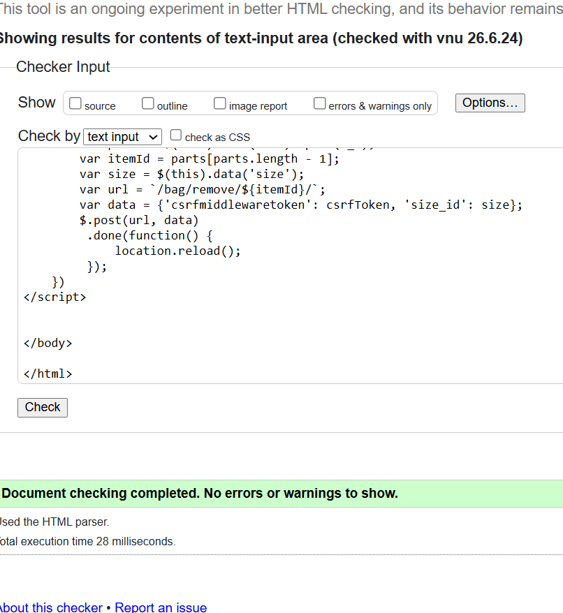 | no errors on both as user logged in and anonymous user|
| checkout | [checkout.html](https://github.com/Rubina1978/native-spirit-studio/blob/main/checkout/templates/checkout/checkout.html) | [w3c](https://validator.w3.org/nu/?showsource=yes&doc=https%3A%2F%2Fnative-spirit-studio-3057c5b47433.herokuapp.com%2Fcheckout%2F) | 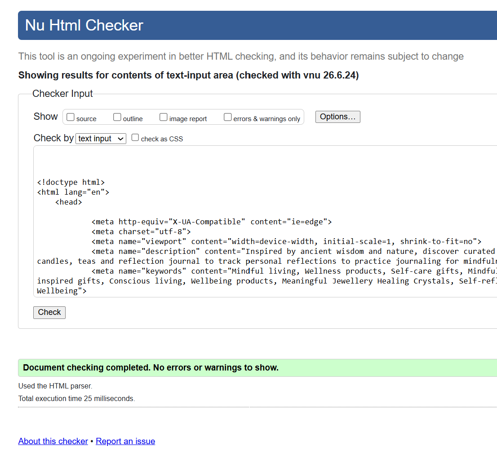 | no errors both logged in and anonymous |
| checkout | [checkout_success.html](https://github.com/Rubina1978/native-spirit-studio/blob/main/checkout/templates/checkout/checkout_success.html) | [w3c](https://validator.w3.org/nu/?showsource=yes&doc=https%3A%2F%2Fnative-spirit-studio-3057c5b47433.herokuapp.com%2Fcheckout%2Fcheckout_success%2F55B9D802920B474795AFF1B8C4B0A9E9%2F) | 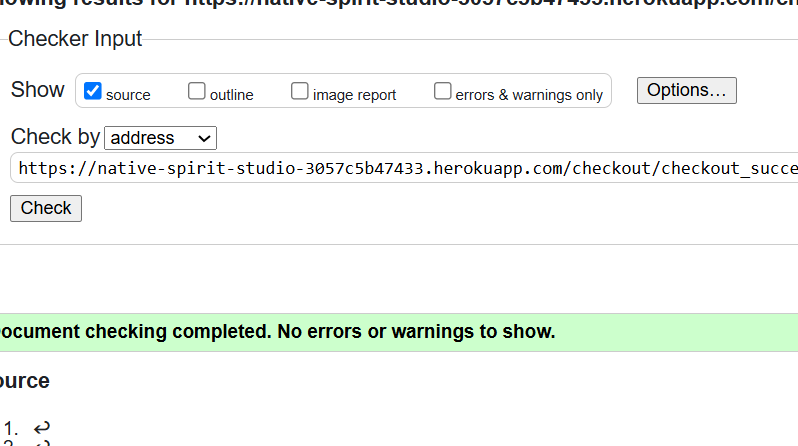 | no errors signed in or anonymous |
| home | [index.html](https://github.com/Rubina1978/native-spirit-studio/blob/main/home/templates/home/index.html) | [w3c](https://validator.w3.org/nu/?doc=https%3A%2F%2Fnative-spirit-studio-3057c5b47433.herokuapp.com%2F) | 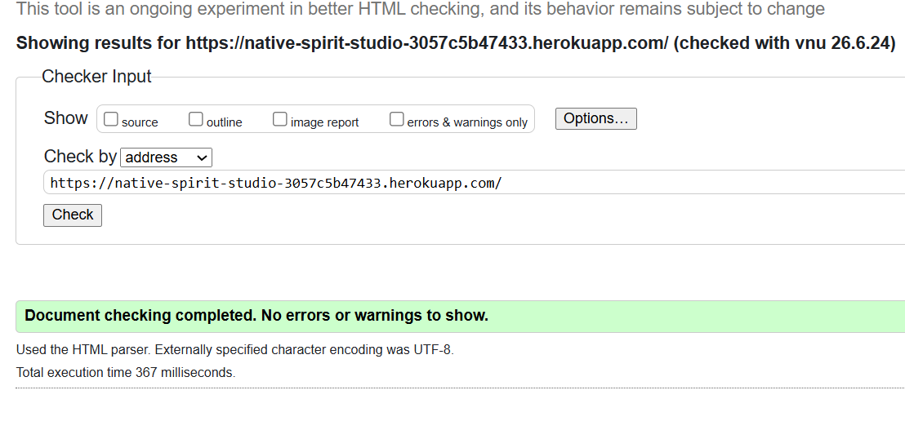 | n/a |
| journal | [add_reflection.html](https://github.com/Rubina1978/native-spirit-studio/blob/main/journal/templates/journal/add_reflection.html) | n/a | 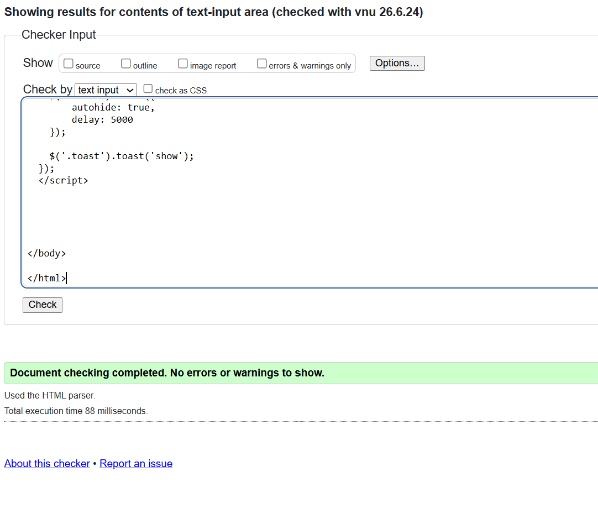 | n/a |
| journal | [journal.html](https://github.com/Rubina1978/native-spirit-studio/blob/main/journal/templates/journal/journal.html) | n/a | 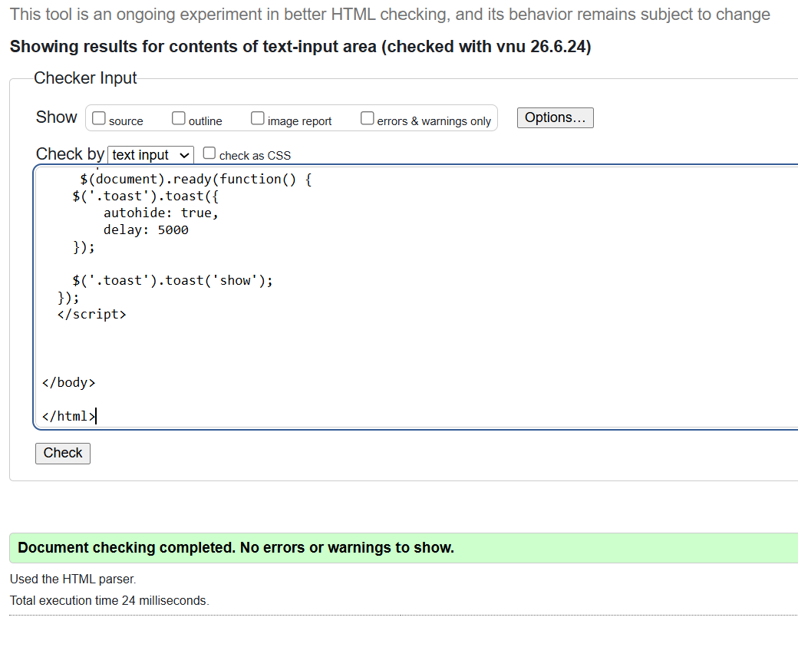 | n/a |
| products | [add_product.html](https://github.com/Rubina1978/native-spirit-studio/blob/main/products/templates/products/add_product.html) | n/a | 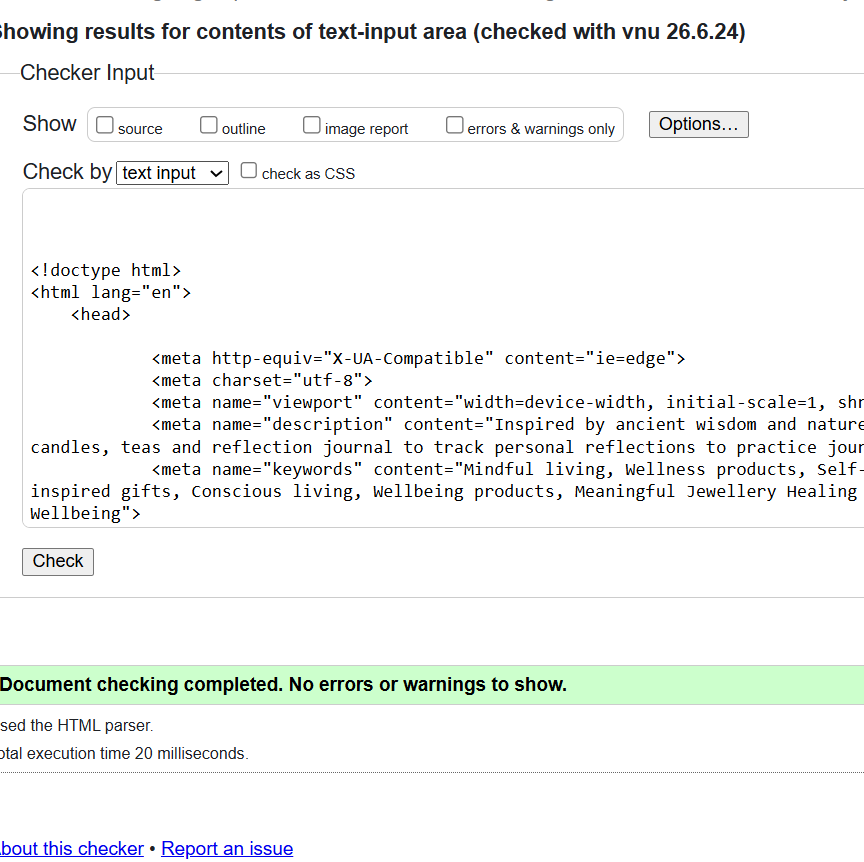 | n/a |
| products | [edit_product.html](https://github.com/Rubina1978/native-spirit-studio/blob/main/products/templates/products/edit_product.html) | n/a | 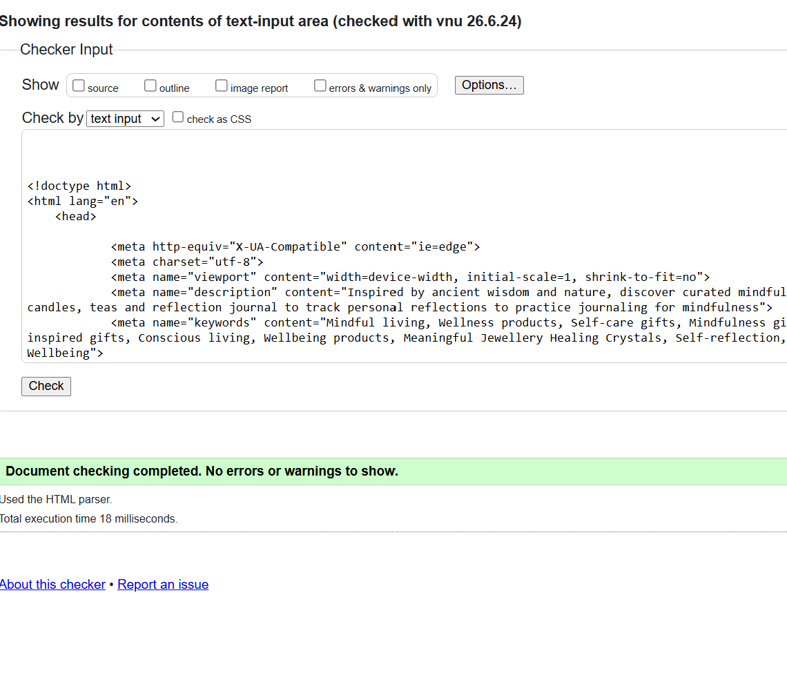 | n/a |
| products | [product_detail.html](https://github.com/Rubina1978/native-spirit-studio/blob/main/products/templates/products/product_detail.html) | [w3c](https://validator.w3.org/nu/?doc=https%3A%2F%2Fnative-spirit-studio-3057c5b47433.herokuapp.com%2Fproducts%2F26%2F) | 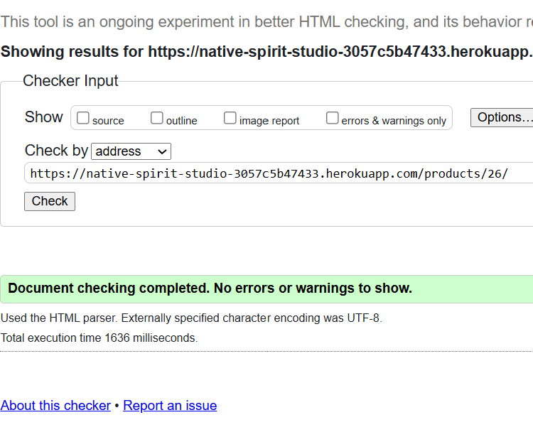 | n/a |
| products | [products.html](https://github.com/Rubina1978/native-spirit-studio/blob/main/products/templates/products/products.html) | [w3c](https://validator.w3.org/nu/?doc=https%3A%2F%2Fnative-spirit-studio-3057c5b47433.herokuapp.com%2Fproducts%2F) | 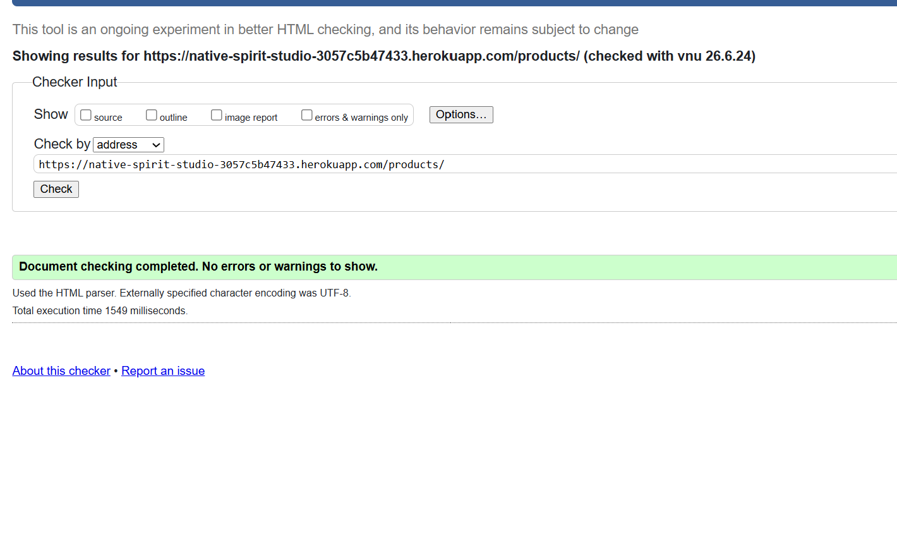 | n/a |
| profiles | [profile.html](https://github.com/Rubina1978/native-spirit-studio/blob/main/profiles/templates/profiles/profile.html) | [w3c](https://validator.w3.org/nu/?doc=https%3A%2F%2Fnative-spirit-studio-3057c5b47433.herokuapp.com%2Fprofile%2F) | 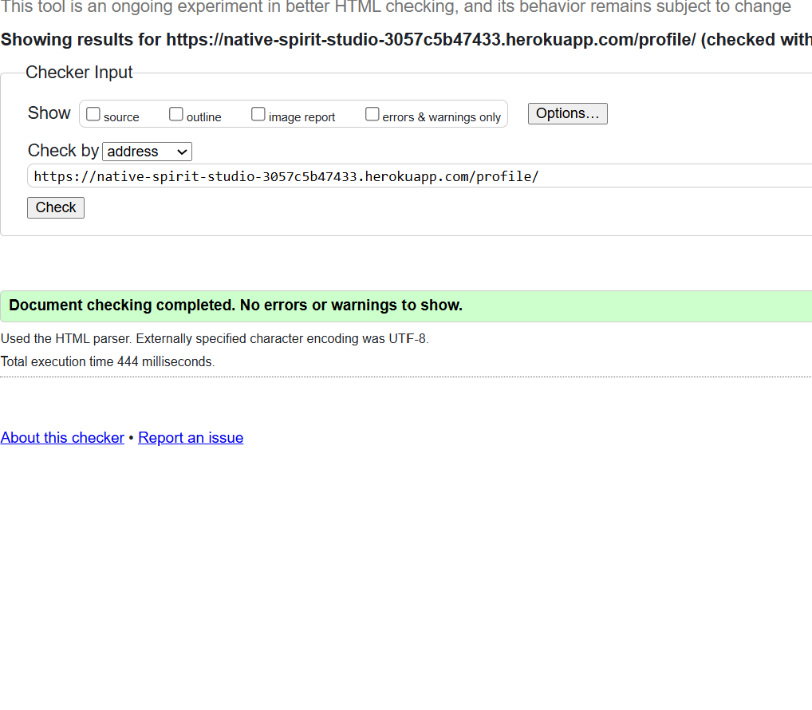 | n/a |

### CSS

I have used the recommended [CSS Jigsaw Validator](https://jigsaw.w3.org/css-validator) to validate all of my CSS files.

| Directory | File | URL | Screenshot | Notes |
| --- | --- | --- | --- | --- |
| checkout | [checkout.css](https://github.com/Rubina1978/native-spirit-studio/blob/main/checkout/static/checkout/css/checkout.css) | n/a| 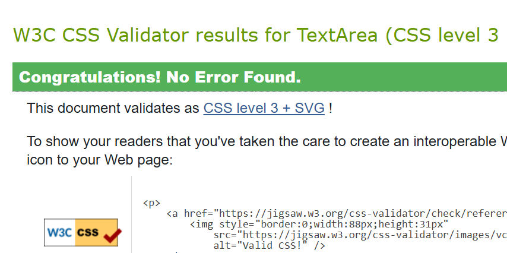 | all ok |
| journal | [journal.css](https://github.com/Rubina1978/native-spirit-studio/blob/main/journal/static/journal/css/journal.css) | n/a | 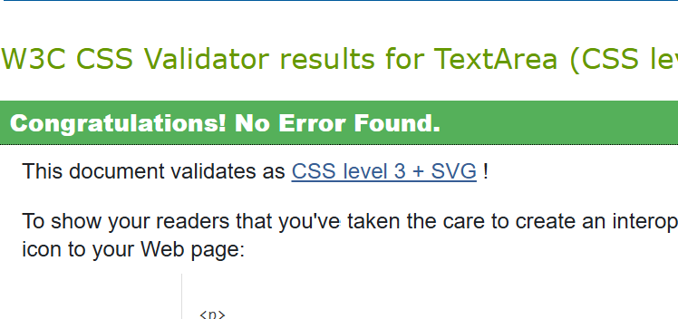 | all ok |
| profiles | [profile.css](https://github.com/Rubina1978/native-spirit-studio/blob/main/profiles/static/profiles/css/profile.css) | n/a | 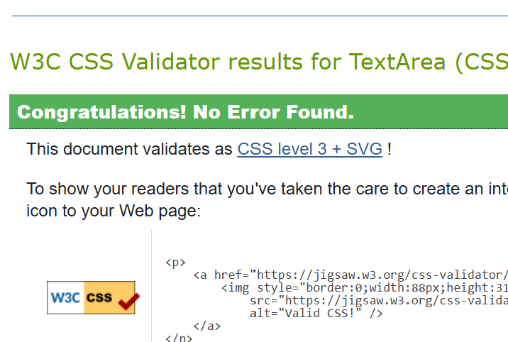 | all ok|
| static | [base.css](https://github.com/Rubina1978/native-spirit-studio/blob/main/static/css/base.css) | [w3c](https://jigsaw.w3.org/css-validator/validator?uri=https%3A%2F%2Fnative-spirit-studio-3057c5b47433.herokuapp.com%2F&profile=css3svg&usermedium=all&warning=1&vextwarning=&lang=en) | 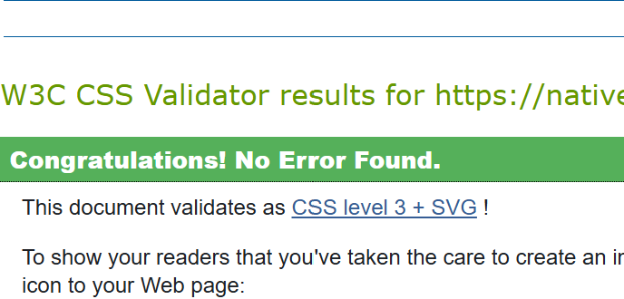 | all ok|

### JavaScript

I have used the recommended [JShint Validator](https://jshint.com) to validate all of my JS files.

| Directory | File | URL | Screenshot | Notes |
| --- | --- | --- | --- | --- |
| checkout | [stripe_elements.js](https://github.com/Rubina1978/native-spirit-studio/blob/main/checkout/static/checkout/js/stripe_elements.js) |  | 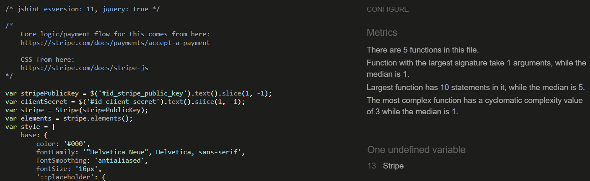 | all ok |
| profiles | [countryfield.js](https://github.com/Rubina1978/native-spirit-studio/blob/main/profiles/static/profiles/js/countryfield.js) |  | 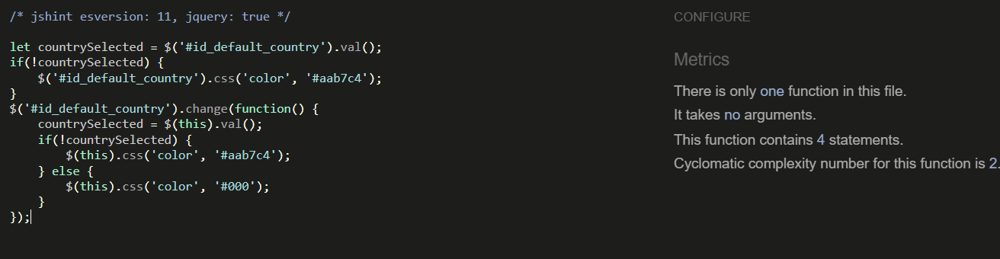 | all ok |
| products | [products.html](https://github.com/Rubina1978/native-spirit-studio/blob/main/products/templates/products/products.html) |  |  | all ok |
| add products | [add_products.html](https://github.com/Rubina1978/native-spirit-studio/blob/main/products/templates/products/add_product.html) |  | 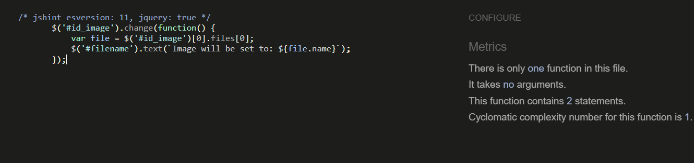 | all ok |
| edit products | [edit_products.html](https://github.com/Rubina1978/native-spirit-studio/blob/main/products/templates/products/edit_product.html) |  | 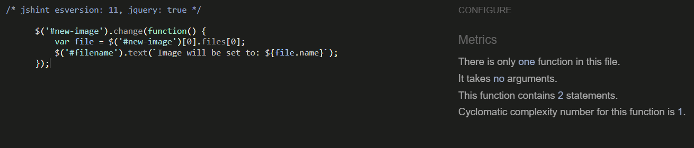 | all ok |

### Python

I have used the recommended [PEP8 CI Python Linter](https://pep8ci.herokuapp.com) to validate all of my Python files.

| Directory | File | URL | Screenshot | Notes |
| --- | --- | --- | --- | --- |
| bag | [context.py](https://github.com/Rubina1978/native-spirit-studio/blob/main/bag/context.py) | [PEP8 CI Link](https://pep8ci.herokuapp.com/https://raw.githubusercontent.com/Rubina1978/native-spirit-studio/refs/heads/main/bag/context.py) | 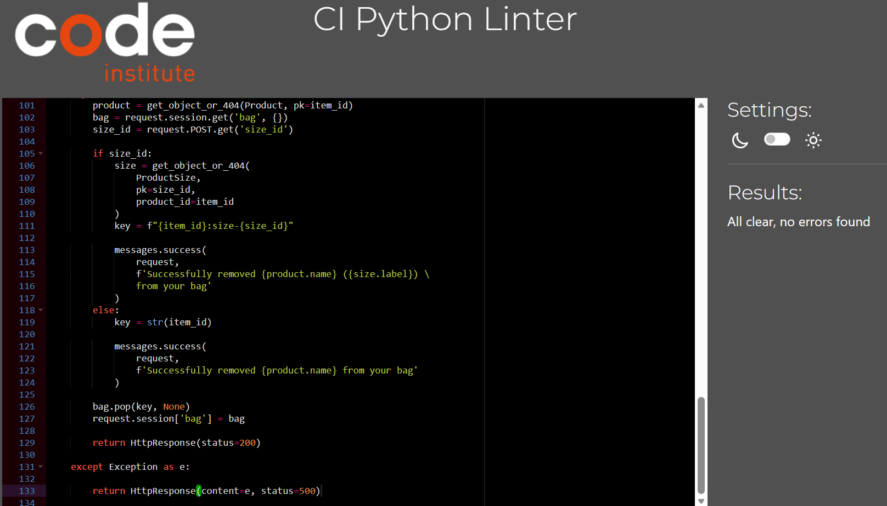 |  |
| bag | [urls.py](https://github.com/Rubina1978/native-spirit-studio/blob/main/bag/urls.py) | [PEP8 CI Link](https://pep8ci.herokuapp.com/https://raw.githubusercontent.com/Rubina1978/native-spirit-studio/main/bag/urls.py) | 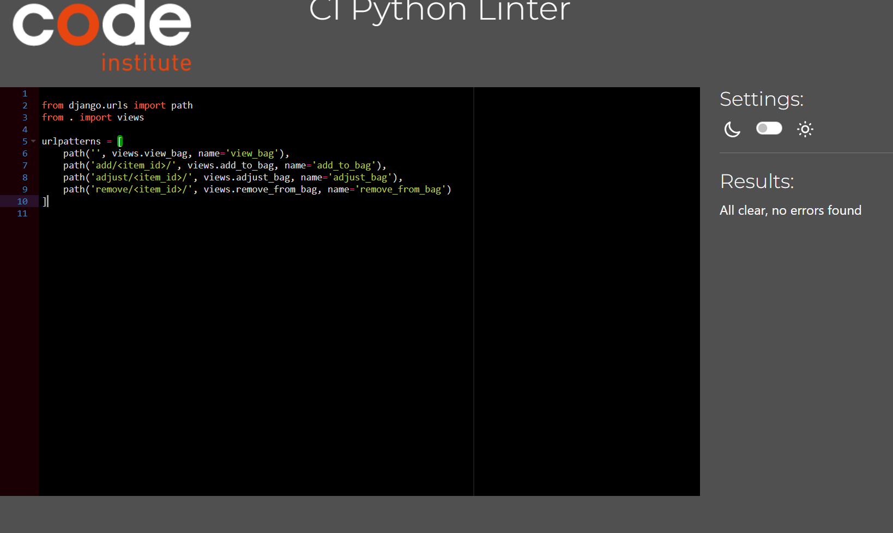 |  |
| bag | [views.py](https://github.com/Rubina1978/native-spirit-studio/blob/main/bag/views.py) | [PEP8 CI Link](https://pep8ci.herokuapp.com/https://raw.githubusercontent.com/Rubina1978/native-spirit-studio/refs/heads/main/bag/views.py) | 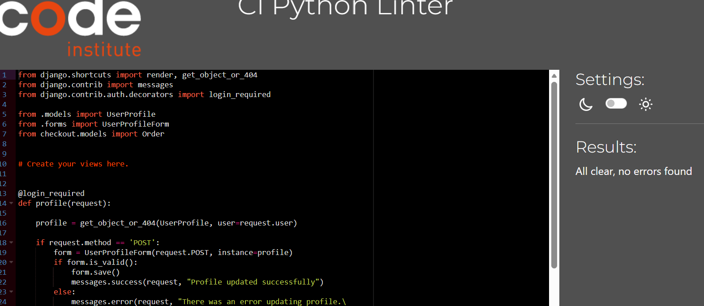 |  |
| checkout | [admin.py](https://github.com/Rubina1978/native-spirit-studio/blob/main/checkout/admin.py) | [PEP8 CI Link](https://pep8ci.herokuapp.com/https://raw.githubusercontent.com/Rubina1978/native-spirit-studio/refs/heads/main/checkout/admin.py) | 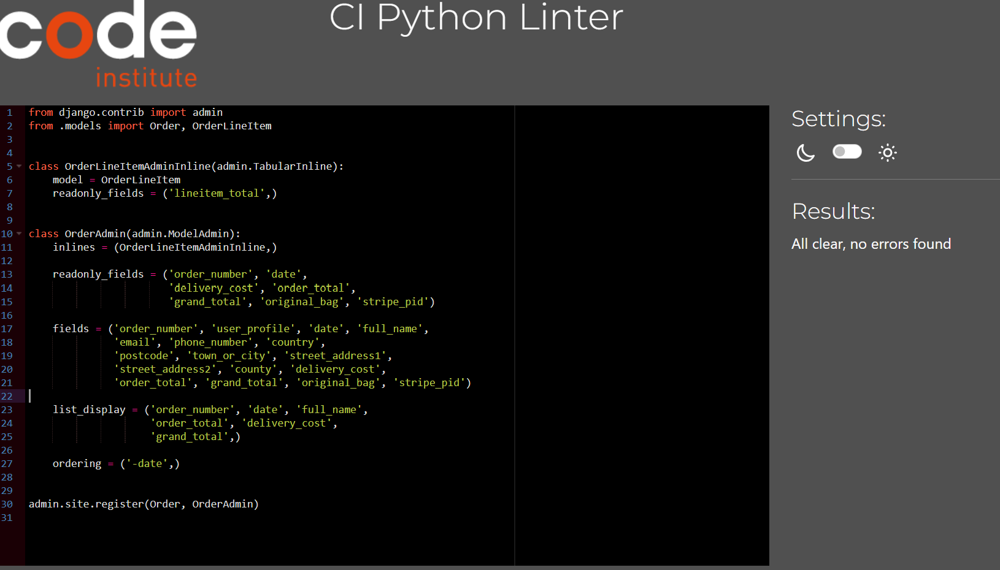 |  |
| checkout | [forms.py](https://github.com/Rubina1978/native-spirit-studio/blob/main/checkout/forms.py) | [PEP8 CI Link](https://pep8ci.herokuapp.com/https://raw.githubusercontent.com/Rubina1978/native-spirit-studio/refs/heads/main/checkout/forms.py) | 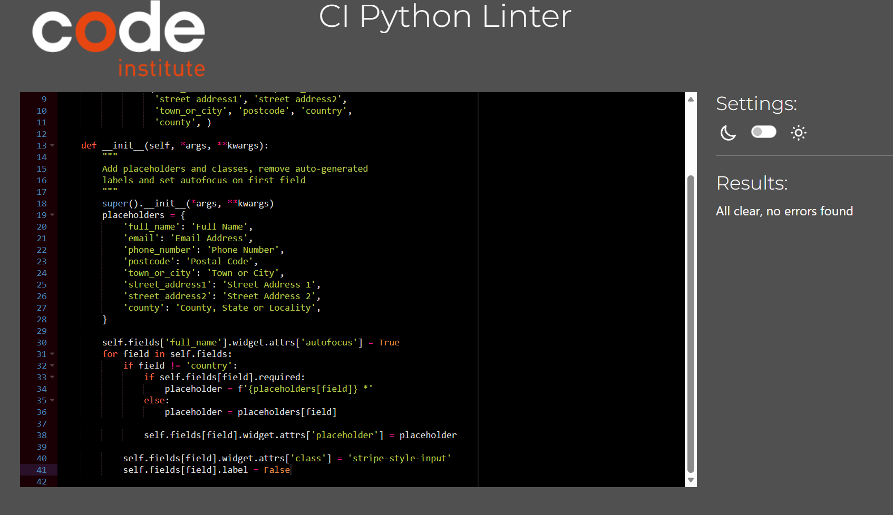 |  |
| checkout | [models.py](https://github.com/Rubina1978/native-spirit-studio/blob/main/checkout/models.py) | [PEP8 CI Link](https://pep8ci.herokuapp.com/https://raw.githubusercontent.com/Rubina1978/native-spirit-studio/refs/heads/main/checkout/models.py) | 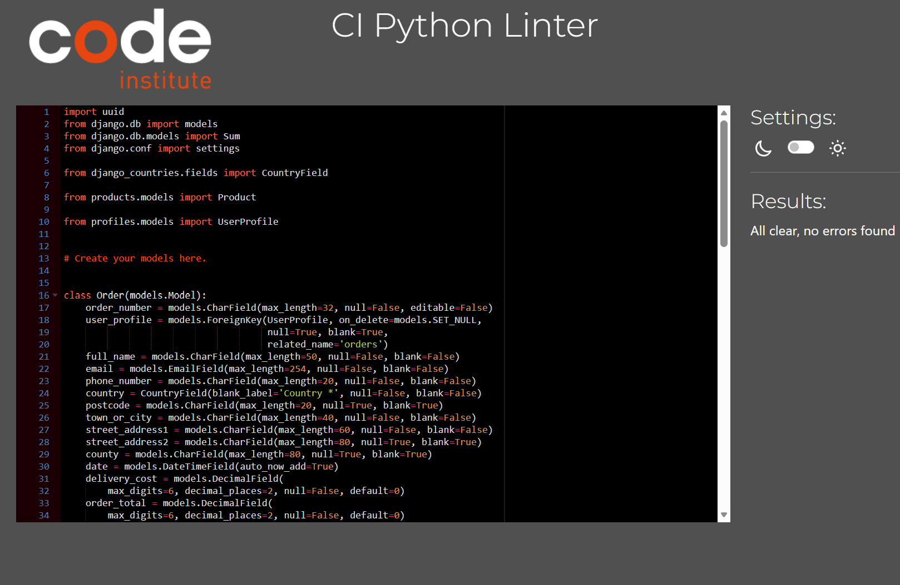 |  |
| checkout | [signals.py](https://github.com/Rubina1978/native-spirit-studio/blob/main/checkout/signals.py) | [PEP8 CI Link](https://pep8ci.herokuapp.com/https://raw.githubusercontent.com/Rubina1978/native-spirit-studio/refs/heads/main/checkout/signals.py) | 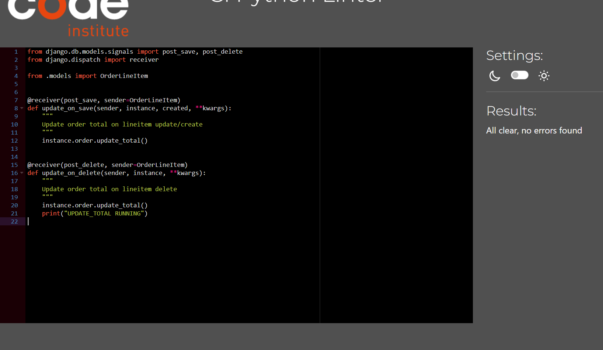 |  |
| checkout | [urls.py](https://github.com/Rubina1978/native-spirit-studio/blob/main/checkout/urls.py) | [PEP8 CI Link](https://pep8ci.herokuapp.com/https://raw.githubusercontent.com/Rubina1978/native-spirit-studio/refs/heads/main/checkout/urls.py) | 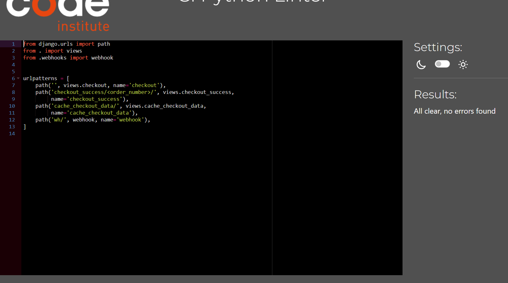 |  |
| checkout | [views.py](https://github.com/Rubina1978/native-spirit-studio/blob/main/checkout/views.py) | [PEP8 CI Link](https://pep8ci.herokuapp.com/https://raw.githubusercontent.com/Rubina1978/native-spirit-studio/refs/heads/main/checkout/views.py) | 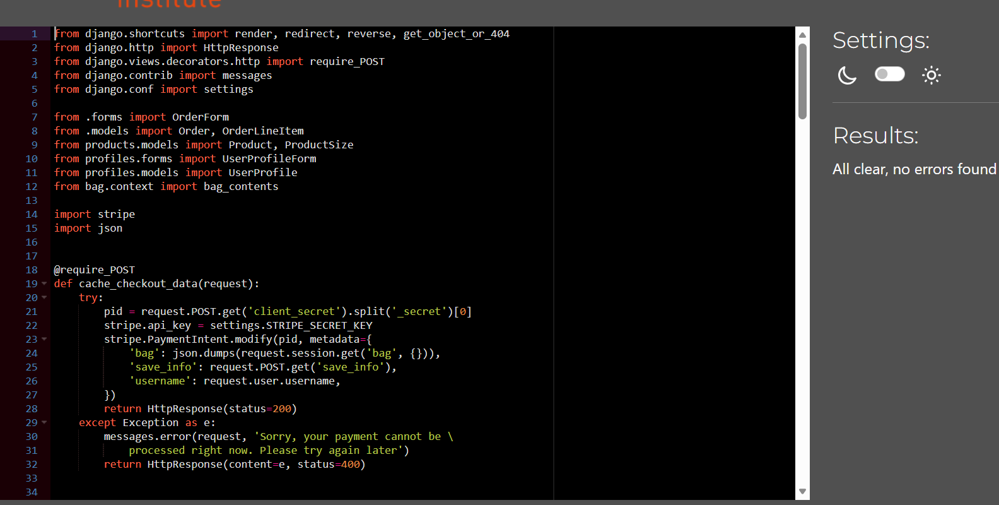 |  |
| checkout | [webhook_handler.py](https://github.com/Rubina1978/native-spirit-studio/blob/main/checkout/webhook_handler.py) | [PEP8 CI Link](https://pep8ci.herokuapp.com/https://raw.githubusercontent.com/Rubina1978/native-spirit-studio/refs/heads/main/checkout/webhook_handler.py) | 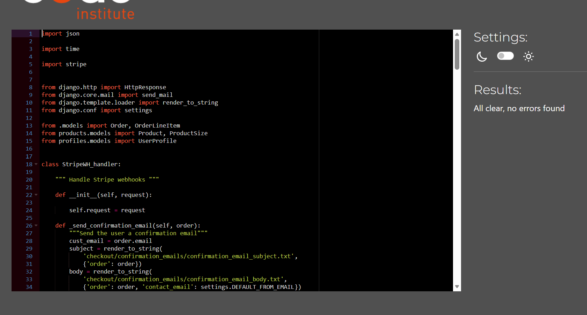 |  |
| checkout | [webhooks.py](https://github.com/Rubina1978/native-spirit-studio/blob/main/checkout/webhooks.py) | [PEP8 CI Link](https://pep8ci.herokuapp.com/https://raw.githubusercontent.com/Rubina1978/native-spirit-studio/refs/heads/main/checkout/webhooks.py) | 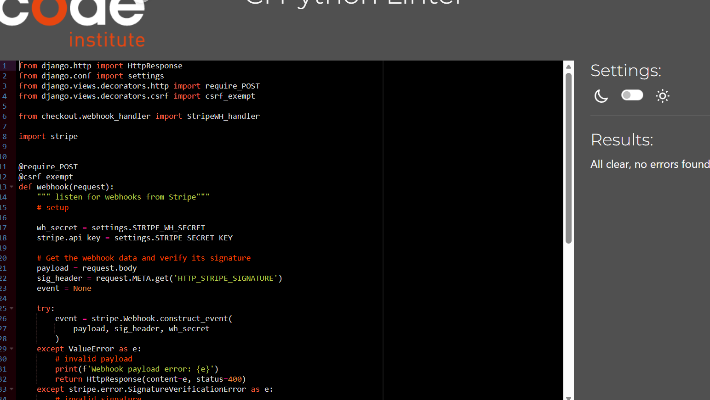 |  |
| home | [urls.py](https://github.com/Rubina1978/native-spirit-studio/blob/main/home/urls.py) | [PEP8 CI Link](https://pep8ci.herokuapp.com/https://raw.githubusercontent.com/Rubina1978/native-spirit-studio/refs/heads/main/home/urls.py) | 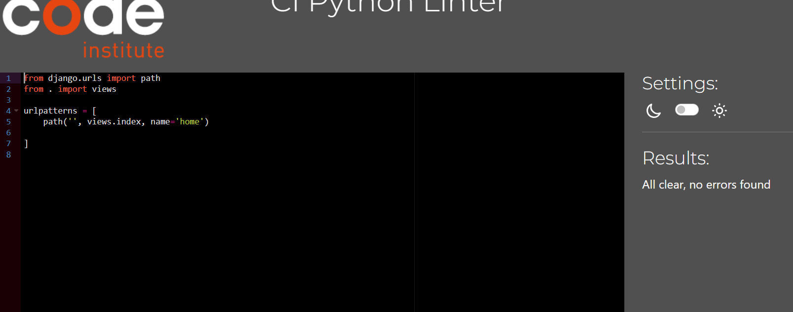 |  |
| home | [views.py](https://github.com/Rubina1978/native-spirit-studio/blob/main/home/views.py) | [PEP8 CI Link](https://pep8ci.herokuapp.com/https://raw.githubusercontent.com/Rubina1978/native-spirit-studio/refs/heads/main/home/views.py) | 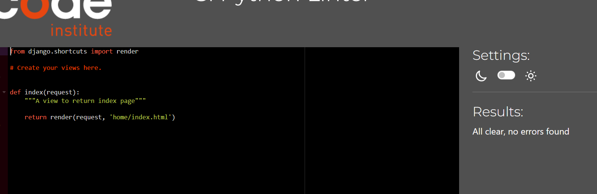 |  |
| journal | [admin.py](https://github.com/Rubina1978/native-spirit-studio/blob/main/journal/admin.py) | [PEP8 CI Link](https://pep8ci.herokuapp.com/https://raw.githubusercontent.com/Rubina1978/native-spirit-studio/refs/heads/main/journal/admin.py) | 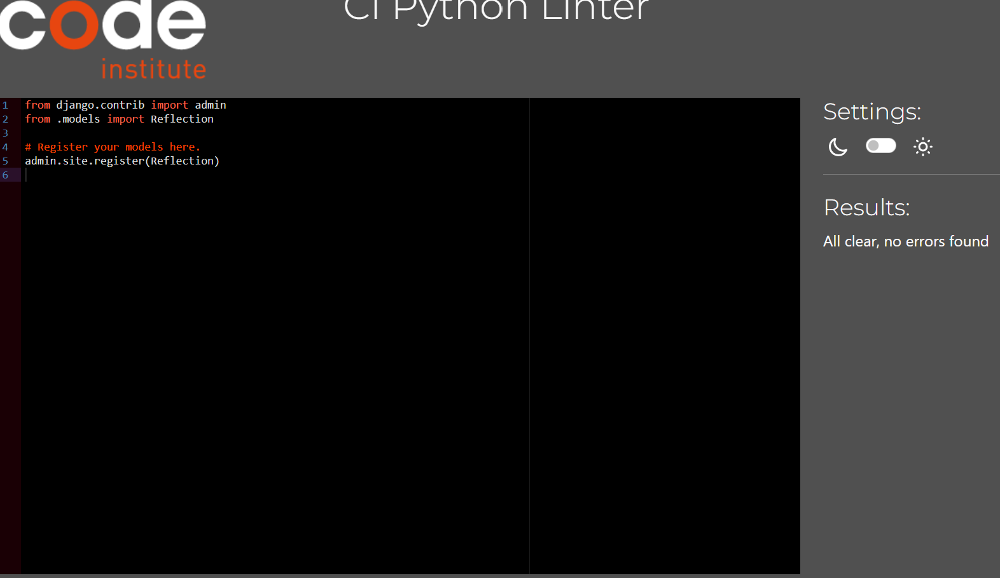 |  |
| journal | [forms.py](https://github.com/Rubina1978/native-spirit-studio/blob/main/journal/forms.py) | [PEP8 CI Link](https://pep8ci.herokuapp.com/https://raw.githubusercontent.com/Rubina1978/native-spirit-studio/refs/heads/main/journal/forms.py) | 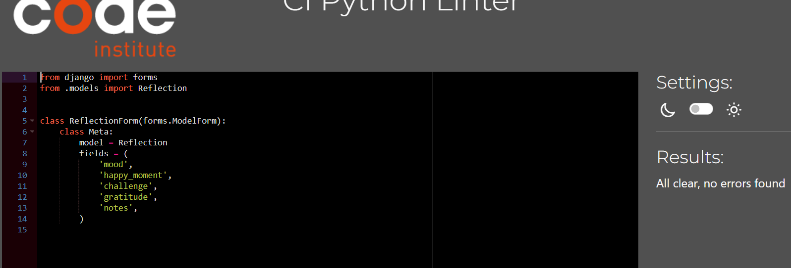 |  |
| journal | [models.py](https://github.com/Rubina1978/native-spirit-studio/blob/main/journal/models.py) | [PEP8 CI Link](https://pep8ci.herokuapp.com/https://raw.githubusercontent.com/Rubina1978/native-spirit-studio/refs/heads/main/journal/models.py) | 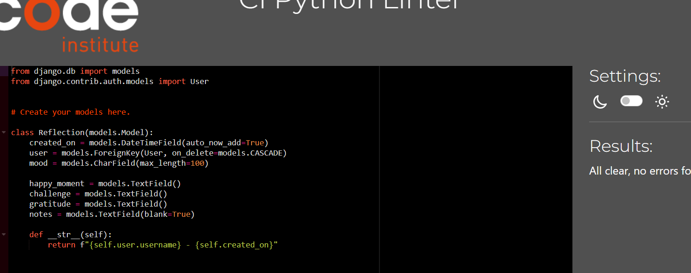 |  |
| journal | [tests.py](https://github.com/Rubina1978/native-spirit-studio/blob/main/journal/tests.py) | [PEP8 CI Link](https://raw.githubusercontent.com/Rubina1978/native-spirit-studio/refs/heads/main/journal/tests.py) | 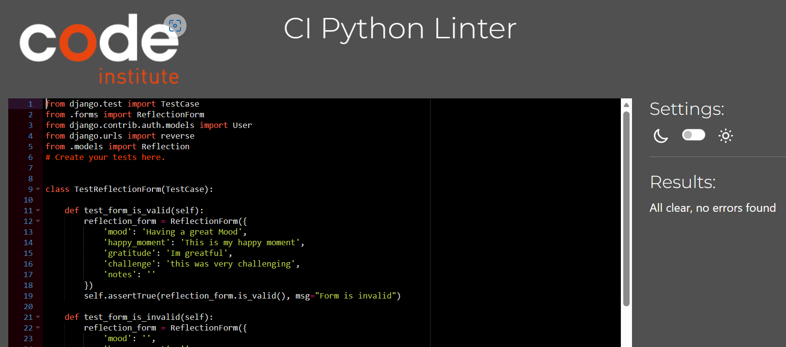 |  |
| journal | [urls.py](https://github.com/Rubina1978/native-spirit-studio/blob/main/journal/urls.py) | [PEP8 CI Link](https://pep8ci.herokuapp.com/https://raw.githubusercontent.com/Rubina1978/native-spirit-studio/main/journal/urls.py) | 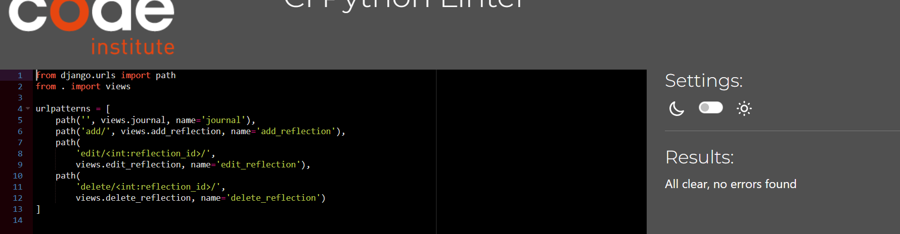 |  |
| journal | [views.py](https://github.com/Rubina1978/native-spirit-studio/blob/main/journal/views.py) | [PEP8 CI Link](https://pep8ci.herokuapp.com/https://raw.githubusercontent.com/Rubina1978/native-spirit-studio/refs/heads/main/journal/views.py) | 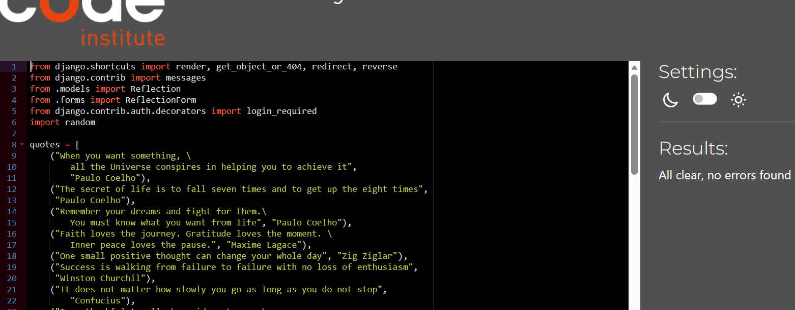 |  |
| native_spirit_studio  | [manage.py](https://github.com/Rubina1978/native-spirit-studio/blob/main/manage.py) | [PEP8 CI Link](https://pep8ci.herokuapp.com/https://raw.githubusercontent.com/Rubina1978/native-spirit-studio/refs/heads/main/manage.py) | 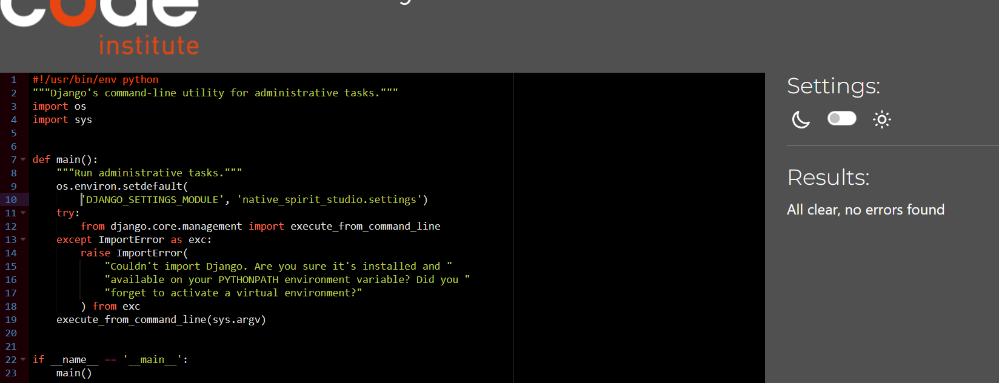 |  |
| native_spirit_studio | [settings.py](https://github.com/Rubina1978/native-spirit-studio/blob/main/native_spirit_studio/settings.py) | [PEP8 CI Link](https://pep8ci.herokuapp.com/https://raw.githubusercontent.com/Rubina1978/native-spirit-studio/refs/heads/main/native_spirit_studio/settings.py) | 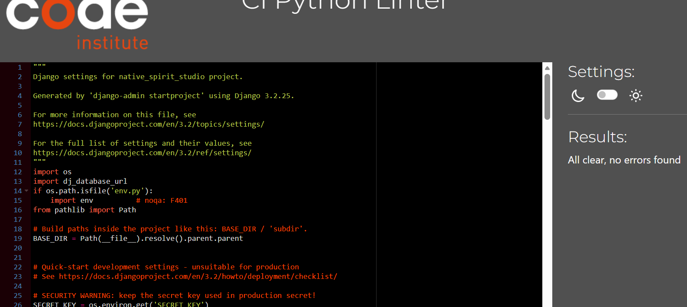 |  |
| native_spirit_studio | [urls.py](https://github.com/Rubina1978/native-spirit-studio/blob/main/native_spirit_studio/urls.py) | [PEP8 CI Link](https://pep8ci.herokuapp.com/https://raw.githubusercontent.com/Rubina1978/native-spirit-studio/main/native_spirit_studio/urls.py) | 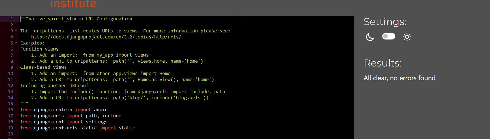 |  |
| products | [admin.py](https://github.com/Rubina1978/native-spirit-studio/blob/main/products/admin.py) | [PEP8 CI Link](https://pep8ci.herokuapp.com/https://raw.githubusercontent.com/Rubina1978/native-spirit-studio/main/products/admin.py) | 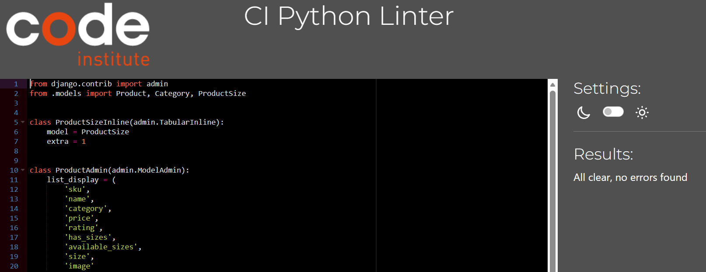 |  |
| products | [forms.py](https://github.com/Rubina1978/native-spirit-studio/blob/main/products/forms.py) | [PEP8 CI Link](https://pep8ci.herokuapp.com/https://raw.githubusercontent.com/Rubina1978/native-spirit-studio/refs/heads/main/products/forms.py) | 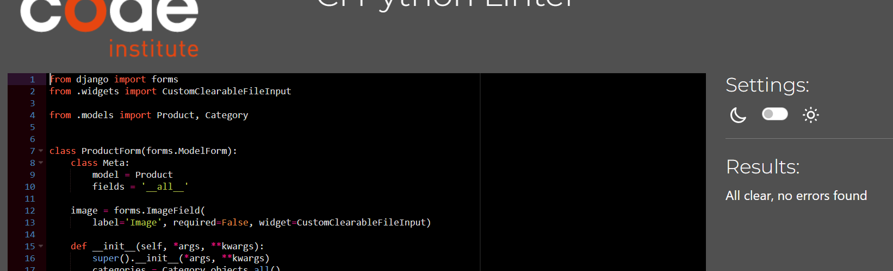 |  |
| products | [models.py](https://github.com/Rubina1978/native-spirit-studio/blob/main/products/models.py) | [PEP8 CI Link](https://pep8ci.herokuapp.com/https://github.com/Rubina1978/native-spirit-studio/blob/main/products/models.py) | 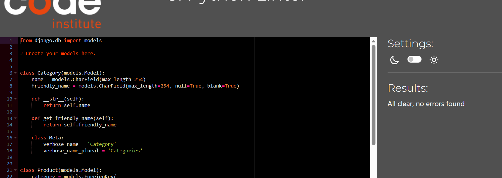 |  |
| products | [urls.py](https://github.com/Rubina1978/native-spirit-studio/blob/main/products/urls.py) | [PEP8 CI Link](https://pep8ci.herokuapp.com/https://raw.githubusercontent.com/Rubina1978/native-spirit-studio/refs/heads/main/products/urls.py) | 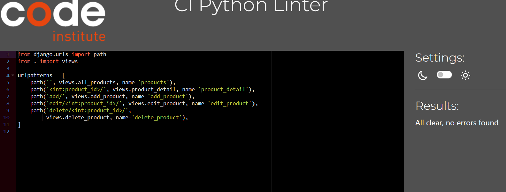 |  |
| products | [views.py](https://github.com/Rubina1978/native-spirit-studio/blob/main/products/views.py) | [PEP8 CI Link](https://pep8ci.herokuapp.com/https://raw.githubusercontent.com/Rubina1978/native-spirit-studio/refs/heads/main/products/views.py) | 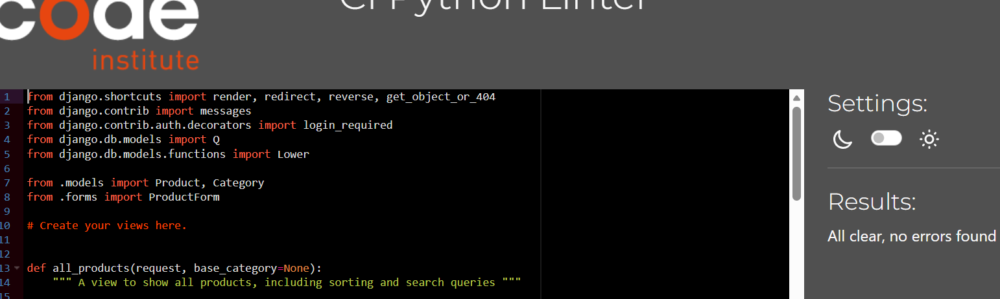 |  |
| products | [widgets.py](https://github.com/Rubina1978/native-spirit-studio/blob/main/products/widgets.py) | [PEP8 CI Link](https://pep8ci.herokuapp.com/https://raw.githubusercontent.com/Rubina1978/native-spirit-studio/refs/heads/main/products/widgets.py) | 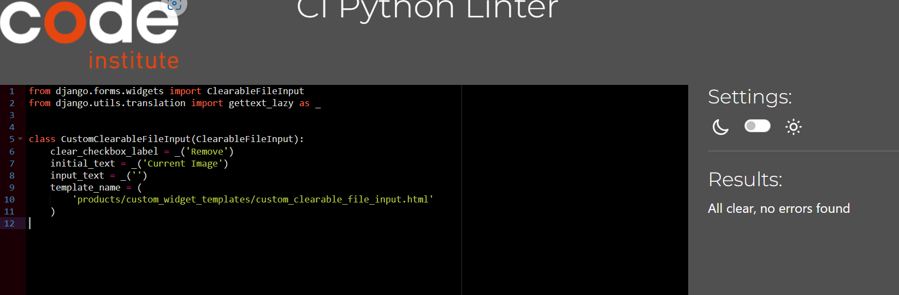 |  |
| profiles | [forms.py](https://github.com/Rubina1978/native-spirit-studio/blob/main/profiles/forms.py) | [PEP8 CI Link](https://pep8ci.herokuapp.com/https://raw.githubusercontent.com/Rubina1978/native-spirit-studio/main/profiles/forms.py) | 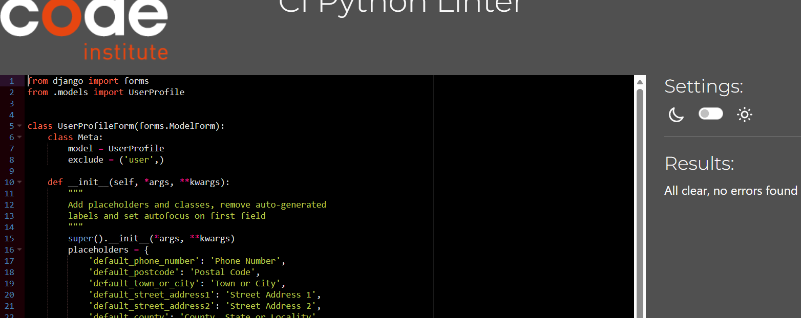 |  |
| profiles | [models.py](https://github.com/Rubina1978/native-spirit-studio/blob/main/profiles/models.py) | [PEP8 CI Link](https://pep8ci.herokuapp.com/https://raw.githubusercontent.com/Rubina1978/native-spirit-studio/refs/heads/main/profiles/models.py) | 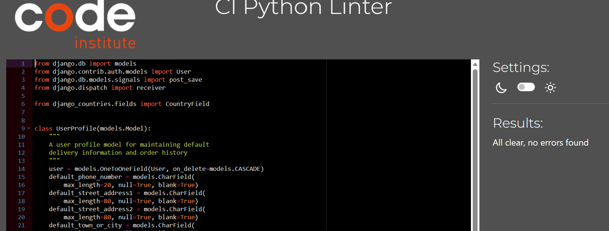 |  |
| profiles | [urls.py](https://github.com/Rubina1978/native-spirit-studio/blob/main/profiles/urls.py) | [PEP8 CI Link](https://pep8ci.herokuapp.com/https://raw.githubusercontent.com/Rubina1978/native-spirit-studio/refs/heads/main/profiles/urls.py) | 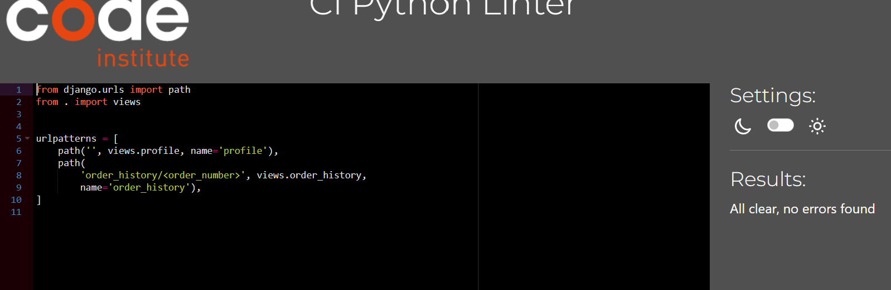 |  |
| profiles | [views.py](https://github.com/Rubina1978/native-spirit-studio/blob/main/profiles/views.py) | [PEP8 CI Link](https://raw.githubusercontent.com/Rubina1978/native-spirit-studio/refs/heads/main/profiles/views.py) |  |  |

## Responsiveness

I've tested my deployed project to check for responsiveness issues.

| Page | Mobile | Tablet | Desktop | Notes |
| --- | --- | --- | --- | --- |
| Register |  |  |  | Works as expected |
| Login |  |  |  | Works as expected |
| Profile |  |  |  | Works as expected |
| Home |  |  |  | Works as expected |
| Products |  |  |  | Works as expected |
| Product Details |  |  |  | Works as expected |
| Bag |  |  |  | Works as expected |
| Checkout |  |  |  | Works as expected |
| Checkout Success |  |  |  | Works as expected |
| Add Product |  |  |  | Works as expected |
| Edit Product |  |  |  | Works as expected |
| Journal |  |  |  | Works as expected |
| Add Reflection |  |  |  | Works as expected |
| 404 |  |  |  | Works as expected |

## Browser Compatibility

I've tested my deployed project on multiple browsers to check for compatibility issues.

| Page | Chrome | Firefox | Edge | Notes |
| --- | --- | --- | --- | --- |
| Register |  |  |  | Works as expected |
| Login |  |  |  | Works as expected |
| Profile |  |  |  | Works as expected |
| Home |  |  |  | Works as expected |
| Products |  |  |  | Works as expected |
| Product Details |  |  |  | Works as expected |
| Bag |  |  |  | Works as expected |
| Checkout |  |  |  | Works as expected |
| Checkout Success |  |  |  | Works as expected |
| Add Product |  |  |  | Works as expected |
| Edit Product |  |  |  | Works as expected |
| Journal |  |  |  | Works as expected |
| Add Reflection |  |  |  | Works as expected |
| 404 |  |  |  | Works as expected |

## Lighthouse Audit

I've tested my deployed project using the Lighthouse Audit tool to check for any major issues. Some warnings are outside of my control, and mobile results tend to be lower than desktop.

| Page | Mobile | Desktop |
| --- | --- | --- |
| Register |  |  |
| Login |  |  |
| Profile |  |  |
| Home |  |  |
| Products |  |  |
| Product Details |  |  |
| Bag |  |  |
| Checkout |  |  |
| Checkout Success |  |  |
| Add Product |  |  |
| Edit Product |  |  |
| Journal |  |  |
| Add reflection |  |  |
| 404 |  |  |

## Defensive Programming

Defensive programming was manually tested with the below user acceptance testing:

| Page | Expectation | Test | Result | Screenshot |
| --- | --- | --- | --- | --- |
| Products | Feature is expected to allow users to browse products without registration. | Opened product pages as a guest user. | Products were fully accessible without requiring registration. |  |
| | Feature is expected to sort products by price and name. | Tested sorting options for price (low-to-high/high-to-low) and name (alphabetical). | Sorting worked correctly for all options. |  |
| | Feature is expected to filter products by category. | Applied category filters while browsing products. | Filters worked as expected, displaying only relevant products. |  |
| | Feature is expected to show detailed product information. | Clicked on individual products to view details. | Product details (description, price, image) were displayed correctly. |  |
| Shopping bag | Feature is expected to allow customers to add items to the bag with quantity controls. | Added products to the cart and adjusted quantities. | Items were added successfully, and quantities updated as expected. |  |
| | Feature is expected to allow customers to view and manage their bag. | Opened the shopping bag page and edited cart contents. | Cart contents were displayed, updated, and removed correctly. |  |
| Checkout | Feature is expected to display bag items, grand total, and input fields for checkout. | Proceeded to checkout with items in the bag. | Checkout page displayed bag items, total, and input fields as expected. |  |
| | Feature is expected to allow secure payment via Stripe. | Entered valid card details using Stripe at checkout. | Payment was processed securely, and an order confirmation page was displayed. |  |
| | Feature is expected to send a confirmation email after purchase. | Completed a purchase and checked email inbox. | **Partial Pass** The checkout completed successfully and the success page informed the user that a confirmation email would be sent. However, due to the SMTP compatibility issue identified in production, email delivery could not be verified. This limitation is documented in the Known Issues section |  |
| | Feature is expected to display an order confirmation page with an order number. | Completed a purchase. | Order confirmation page displayed successfully with an order number. |  |
| Account Management | Feature is expected to allow returning customers to log in and view past orders. | Logged in as a returning customer and accessed order history. | Past orders were displayed correctly in the account section. |  |
| | Feature is expected to remember the shipping address for returning customers. | Completed multiple checkouts as a returning customer. | Shipping address was pre-filled on subsequent purchases. |  |
| Admin Features | Feature is expected to allow the site owner to create new products. | Created new products with valid data (name, price, description, image, category). | **Partial Pass** Products without size variants were created successfully and displayed correctly on the site. Products requiring multiple size variants could be created; however, size-specific options and pricing could not be managed through the custom Product Management interface and require further development. This limitation is documented in the Known Issues section. |  |
| | Feature is expected to allow the site owner to update product details. | Edited product details as an admin user. | Product updates were saved and displayed correctly. |  |
| | Feature is expected to allow the site owner to delete products. | Deleted a product from the inventory. | Product was removed successfully from the site, and delete success message shown. |  |
| Orders | Feature is expected to allow the site owner to view all orders placed. | Accessed the orders dashboard as an admin user. | All orders were displayed correctly. |  |
| Journal| Feature is expected to allow signed in users to add reflection and have it shown in journal, or edit/delete existing reflection . | Added reflection to journal. | Reflection card shown in journal with option to edit or delete |  |
| 404 Error Page | Feature is expected to display a 404 error page for non-existent pages. | Navigated to an invalid URL (e.g., `/test`). | A custom 404 error page was displayed as expected. |  |

## User Story Testing

| Target | Expectation | Outcome | Screenshot |
| --- | --- | --- | --- |
| As a shopper | I would like to browse products without needing to register | so that I can shop freely before deciding to create an account. |  |
| As a shopper | I would like to be prompted to create an account or log in at checkout | so that I can complete my purchase and track my order history. |  |
| As registered user | I would like to do mindfulness journaling and add, edit or delete my personal reflections | so that I can improve my wellbeing and look back to the moments worth to capture in my journal. |  |
| As a customer | I would like to browse various product categories (home & decor, wellness, jewelry, special offers, etc.) | so that I can easily find what I'm looking for. |  |
| As a shopper | I would like to sort products by price (low-to-high/high-to-low) and name (alphabetical) | so that I can quickly organize items in a way that suits my shopping style. |  |
| As a customer | I would like to filter products by category | so that I can narrow down the products to the types I am most interested in. |  |
| As a shopper | I would like to click on individual products to view more details (description, price, image, etc.) | so that I can make an informed decision about my purchase. |  |
| As a shopper | I would like to add items to my shopping bag using quantity increment/decrement buttons | so that I can adjust my shopping bag before checkout. |  |
| As shopper | I would like to view my shopping bag | so that I can review, add, or remove items before proceeding to checkout and don't overspend. |  |
| As a shopper | I would like to adjust the quantity of items in my shopping bag | so that I can modify my purchase preferences without leaving the cart. |  |
| As a shopper | I would like to remove items from my shopping bag | so that I can remove products I no longer wish to buy. |  |
| As a shopper | I would like to proceed to checkout where I see my my items in my shopping bag, grand total, and input my name, email, shipping address, and card details | so that I can complete my purchase. |  |
| As a shopper | I would like to receive a confirmation email after my purchase | so that I can have a record of my transaction and order details. |  |
| As a shopper | I would like to see an order confirmation page with a checkout order number after completing my purchase | so that I know my order has been successfully placed. |  |
| As a shopper | I would like to securely enter my card details using Stripe at checkout | so that I can feel confident my payment information is protected. |  |
| As a returning customer | I would like to be able to log in and view my past orders | so that I can track my previous purchases and order history. |  |
| As a returning customer | I would like the checkout process to remember my shipping address | so that future purchases are quicker and easier. |  |
| As a site owner | I would like to create new products with a name, description, price, images, and category | so that I can add additional items to the store inventory. |  |
| As a site owner | I would like to update product details (name, price, description, image, category) at any time | so that I can keep my product listings accurate and up to date. |  |
| As a site owner | I would like to delete products that are no longer available or relevant | so that I can maintain a clean and accurate inventory. |  |
| As a site owner | I would like to view all orders placed on the website | so that I can track and manage customer purchases. |  |
| As a site owner | I would like to manage product categories | so that I can ensure items are correctly organized and easy for customers to find. |  |
| As a user | I would like to see a 404 error page if I get lost | so that it's obvious that I've stumbled upon a page that doesn't exist. |  |

## Automated Testing

I have conducted a series of automated tests on my application.

> [!NOTE]  
> I fully acknowledge and understand that, in a real-world scenario, an extensive set of additional tests would be more comprehensive.

### Python (Unit Testing)

⚠️ INSTRUCTIONS ⚠️

Adjust the code below (file names, function names, etc.) to match your own project files/folders. Use these notes loosely when documenting your own Python Unit tests, and remove/adjust where applicable.

⚠️ SAMPLE ⚠️

I have used Django's built-in unit testing framework to test the application functionality. In order to run the tests, I ran the following command in the terminal each time:

- `python3 manage.py test name-of-app`

To create the coverage report, I would then run the following commands:

- `pip3 install coverage`
- `pip3 freeze --local > requirements.txt`
- `coverage run --omit="*/site-packages/*,*/migrations/*,*/__init__.py,env.py,.env" manage.py test`
- `coverage report`

To see the HTML version of the reports, and find out whether some pieces of code were missing, I ran the following commands:

- `coverage html`
- `python3 -m http.server`

Below are the results from the full coverage report on my application that I've tested:

#### Unit Test Issues

⚠️ INSTRUCTIONS ⚠️

Use this section to list any known issues you ran into while writing your Python unit tests. Remember to include screenshots (where possible), and a solution to the issue (if known). This can be used for both "fixed" and "unresolved" issues. Remove this sub-section entirely if you somehow didn't run into any issues while working with your tests.

⚠️ --- END --- ⚠️

## Bugs

⚠️ INSTRUCTIONS ⚠️

Nobody likes bugs,... except the assessors! Projects seem more suspicious if a student doesn't properly track their bugs. If you're about to submit your project without any bugs listed below, you should ask yourself why you're doing this course in the first place, if you're able to build this entire application without running into any bugs. The best thing you can do for any project is to document your bugs! Not only does it show the true stages of development, but think of it as breadcrumbs for yourself in the future, should you encounter the same/similar bug again, it acts as a gentle reminder on what you did to fix the bug.

If/when you encounter bugs during the development stages of your project, you should document them here, ideally with a screenshot explaining what the issue was, and what you did to fix the bug.

Alternatively, an improved way to manage bugs is to use the built-in **[Issues](https://www.github.com/Rubina1978/native-spirit-studio/issues)** tracker on your GitHub repository. This can be found at the top of your repository, the tab called "Issues".

If using the Issues tracker for bug management, you can simplify the documentation process for testing. Issues allow you to directly paste screenshots into the issue page without having to first save the screenshot locally. You can add labels to your issues (e.g. `bug`), assign yourself as the owner, and add comments/updates as you progress with fixing the issue(s). Once you've solved the issue/bug, you should then "Close" it.

When showcasing your bug tracking for assessment, you can use the following examples below.

⚠️ --- END --- ⚠️

### Fixed Bugs

I've used [GitHub Issues](https://www.github.com/Rubina1978/native-spirit-studio/issues) to track and manage bugs and issues during the development stages of my project.

All previously closed/fixed bugs can be tracked [here](https://github.com/Rubina1978/native-spirit-studio/issues?q=is%3Aissue%20state%3Aclosed%20sort%3Arelevance-desc%20label%3Abug).

### Unfixed Bugs

Any remaining open issues can be tracked [here](https://www.github.com/Rubina1978/native-spirit-studio/issues?q=is%3Aissue+is%3Aopen+label%3Abug).

### Known Issues

| Issue | Screenshot |
| --- | --- |
| The project is designed to be responsive from `375px` and upwards, in line with the material taught on the course LMS. Minor layout inconsistencies may occur on extra-wide (e.g. 4k/8k monitors), or smart-display devices (e.g. Nest Hub, Smart Watches, Gameboy Color, etc.), as these resolutions are outside the project’s scope, as taught by Code Institute. |  |
| When validating HTML with a semantic `<section>` element, the validator warns about lacking a header `h2-h6`. This is acceptable. | ![screenshot] N/A
| Validation errors on "signup.html" coming from the Django Allauth package. | ![screenshot]N/A |
| With a known order-number, users can brute-force "checkout_success.html" and see potentially sensitive information. |  |
| If a product is in your bag, but then gets deleted from the database, it throws errors from the session storage memory. |  |
| The `-`/`+` quantity buttons work well on "product_details.html", but not on "bag.html". |  |
| The email verification feature provided by Django Allauth is currently disabled in production. During deployment, a compatibility issue was identified between the project's dependency versions (Django 3.2 and Django Allauth 0.50.0) and the Python runtime used by Heroku, causing email verification requests to fail when attempting to send confirmation emails. | ![screenshot]N/A |
| Products with size variants display and function correctly throughout the store, including basket and checkout functionality. However, size variants cannot currently be created through the custom Product Management interface and must be added through the Django admin panel. Due time constrains this could not be resolved and has been identified as a future enhancement. | 

> [!IMPORTANT]  
> There are no remaining bugs that I am aware of, though, even after thorough testing, I cannot rule out the possibility.

